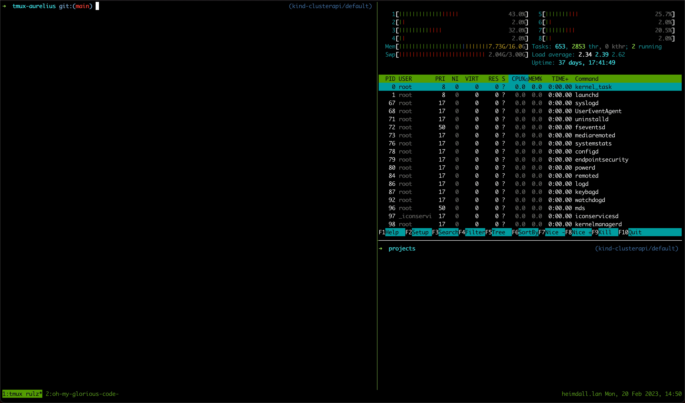

# tmux-aurelius

tmux plugin to display quotes from Marcus Aurelius, Seneca and other Stoics in your tmux terminal.

get inspired by ancient wisdom and stay resilient as you persevere through debugging software and sociotechnical systems.



## Installation

add to list of tpm plugins:
```
set -g @plugin 'davidmontoyago/tmux-aurelius'
```

re-install plugins:
```
<lead> + I
```

## Development

```
make lint
```